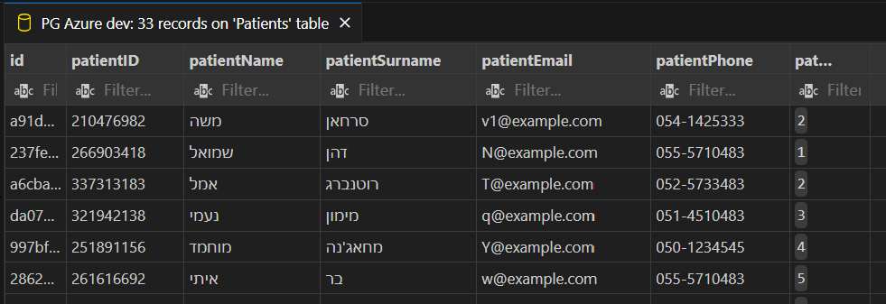
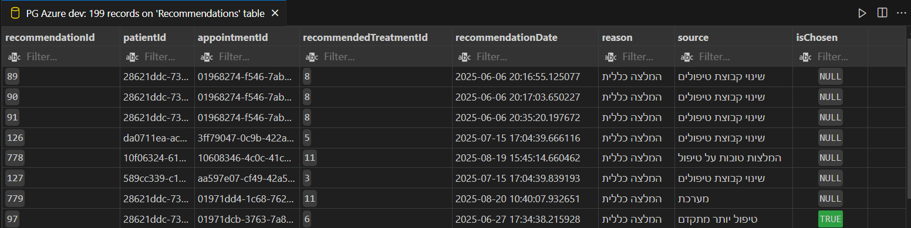

# 🩺 AltermedManager – Backend

## 📌 Overview  
**Have you ever found yourself stuck in bureaucracy when trying to receive medical or complementary treatments?**  
Scheduling an appointment, getting a referral, going back to the doctor, and then to treatment again... this long process makes the patient’s experience frustrating and inefficient. Our system aims to solve this problem by unifying medical records, appointments, treatments, and alternative therapies into one centralized platform.

**🫂One platform. One record. One patient journey.**

**AltermedManager Backend** is the server component of a healthcare management system for **alternative medicine treatments**.  
It exposes a secure **REST API** for managing users, appointments, treatments, recommendations, feedback, notifications, and uploaded medical documents.  

The backend is built with **C# ASP.NET (.NET 9)**, using a **layered architecture**, deployed on **Azure**, and integrated with **PostgreSQL** for persistence.  

## 👩‍💻 Development Team

<table>
  <tr>
    <td align="center">
      <a href="https://www.linkedin.com/in/veronikamerkulova-software/">
        
      </a><br>
      <b>Veronika Merkulova</b><br>
      Backend & System Architecture<br>
      <a href="https://www.linkedin.com/in/veronikamerkulova-software/">LinkedIn</a> |
      <a href="https://github.com/VeroniMe">GitHub</a>
    </td>
    <td align="center">
      <a href="https://www.linkedin.com/in/adiv-roif-418bb3270/">
        
      </a><br>
      <b>Adiv Roif</b><br>
      Frontend (Flutter) & UX<br>
      <a href="https://www.linkedin.com/in/adiv-roif-418bb3270/">LinkedIn</a> |
      <a href="https://github.com/adivroif">GitHub</a>
    </td>
  </tr>
</table>


## 🛠️ Technologies

- **C# ASP.NET (.NET 9)** – main framework for API.  
- **Entity Framework Core** – Object-Relational Mapping for database interactions.  
- **PostgreSQL (Azure Flexible Server)** – relational database.  
- **Docker** – containerization for deployment.  
- **Azure Virtual Machine** – hosting environment.  
- **Firebase Authentication** – user authentication.  
- **Firebase Cloud Messaging (FCM)** – push notifications (backend trigger).  
- **Swagger / OpenAPI** – API documentation.  

As part of the project, a Flutter client was developed, consisting of two applications: one for doctors and one for patients:

[Flutter application - Unified-Medical-File](https://github.com/adivroif/Unified_Medical_File)

## ⚙️ Architecture

The backend follows a **Layered Architecture** pattern:

- **Controllers** – expose REST endpoints.  
- **Services** – business logic and workflows.  
- **Repositories** – data access using EF Core.  
- **DTOs** – secure request/response objects.  
- **Entities** – database models.  

### Security
- JWT authentication integrated with Firebase UID.  
- Role-based access control (Patient, Doctor).  
- Input validation & exception handling middleware.  

## 📂 Main Modules

### 1. Authentication & Users
- Uses Firebase Authentication for identity.  
- Maps Firebase UID → backend roles.  
- Handles role assignment and user profile data.  

### 2. Appointments
- Manages appointments between doctors and patients.  
- Generates **15-minute slots** dynamically.  
- API returns enriched appointment objects with doctor, patient, and treatment info.  

### 3. Treatments & Recommendations
- Repository of alternative medicine treatments.  
- Patients submit feedback → stored in DB.  
- **Rule-based recommendation engine**:  
  - If feedback score is not high (less than 3.0) → suggest alternative treatment.  
  - If rejected → suggest based on treatment group & advancement level.
  
[RecommendationsService](./Services/RecommendationService.cs)

### 4. Patient Feedback
- Collects structured feedback via forms (from patient application).  
- Feedback values drive treatment recommendations.  

### 5. Notifications
- Stored in DB and sent via FCM.  
- **Doctors** → notified of new recommendations & patient requests.  
- **Patients** → notified of approved recommendations & doctor replies. 
 
[NotificationsService](.Services/NotificationsService.cs)

### 6. File Management - (implemented in application)
- Upload photos/files (using FirebaseStorage) in DB.  
- Files stored in Firebase Storage with categories (prescriptions, lab results, treatment summaries).  

### 7. External Providers
- Dummy HMO microservice simulates external healthcare APIs.  
- Allows interoperability testing.  

---

## 📊 Database (Simplified)

- **Users** – patients & doctors.  
- **Appointments** – link users with slots & treatments.  
- **Treatments** – alternative medicine methods & descriptions.  
- **Recommendations** – generated treatment suggestions.  
- **Feedback** – patient scores & responses.  
- **Notifications** – messages delivered via FCM + status.  
- **Files** – uploaded documents metadata (Firebase Storage).  

We will present some snapshots from our database:
1. Patients table:

2. Recommendations Table


## 🚀 Getting started - how to run?

1. **Prerequisites**  
Make sure you have the following installed:

-   .NET 9 SDK    
-   [PostgreSQL](https://www.postgresql.org/download/) (or use the provided connection string to Azure)
2. **Clone the repository**
   ```bash
   git clone https://github.com/adivroif/AltermedServer-master.git
   cd AltermedServer-master
3. **Configure Database**
Update **`appsettings.json`** with your database connection string:

```bash
"ConnectionStrings": {
  "DefaultConnection": "Host=localhost;Port=5432;Database=altermed;Username=postgres;Password=yourpassword"
}
```
Apply migrations (creates database tables):
```bash
dotnet ef database update
```
4. **Run the application**
```bash
dotnet run
```
API will start at: http://localhost:5000
Dummy Health Provider will start at: http://localhost:5047
Swagger documentation is available at: http://localhost:5000/swagger

## 🧪 Testing

The backend includes unit and integration testing to ensure code quality and reliability.

- **Unit Tests** – validate business logic in the Service layer.
- **Integration Tests** – test Controllers and API endpoints with a real database context.  
- **Tools** – xUnit is used as the main testing framework, with FluentAssertions for more readable test cases.  
- **API Testing** – Swagger UI can be used manually, and automated API tests are written with RestSharp for building API requess.  
- **Performance and reliability Tests** - TBD

Testing plan you can find here:
[Test Plan](https://github.com/adivroif/AltermedServer-master/tree/master/Tests)

